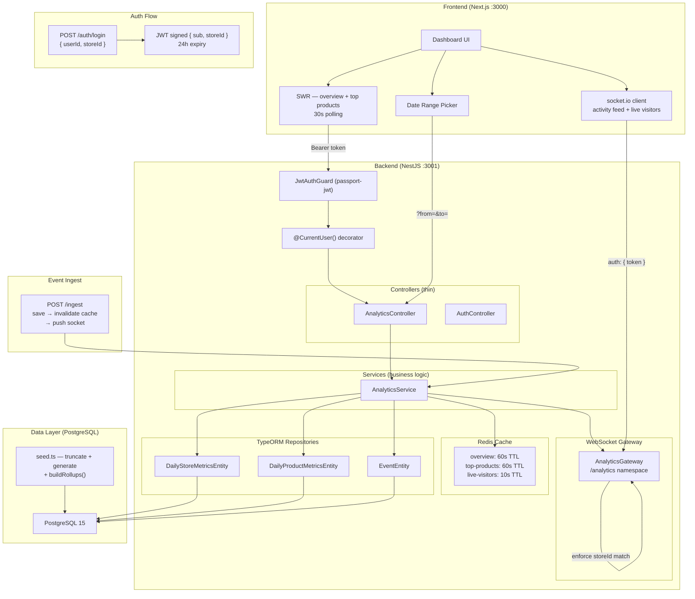

# Amboras Store Analytics Dashboard

Analytics dashboard for Amboras store owners. Revenue (today/week/month), conversion funnel, top 10 products, live activity feed, and real-time visitor monitoring.

---

## What's real vs. simulated

| Layer | Reality |
|---|---|
| Database | PostgreSQL 15 via Docker, persistent volume |
| Cache | Redis 7 via Docker, TTL-based invalidation |
| Auth | JWT (HS256), signed tokens, 24h expiry |
| Real-time | WebSocket via socket.io — push on write, not polling |
| Aggregation | Pre-aggregated daily roll-ups, built by seed on boot |
| Seed | Runs automatically on `docker-compose up` via `SEED_ON_BOOT` |

The only intentional simplification: `/auth/login` accepts any `userId` + `storeId` without a password. Everything else is production-intentioned.

---

## One-command setup
```bash
git clone git@github.com:aetosdios27/Amboras-Take-Home-Assignment-Solution.git
cd Amboras-Take-Home-Assignment-Solution
docker-compose up --build
```

Docker Compose starts PostgreSQL and Redis with health checks, waits for both to pass before booting the backend, seeds the database automatically, then starts the frontend.

| Service | URL |
|---|---|
| Dashboard | http://localhost:3000 |
| Backend API | http://localhost:3001 |
| Swagger docs | http://localhost:3001/api/docs |
| PostgreSQL | localhost:5433 |
| Redis | localhost:6380 |

Login with any seeded account:
```
user_1 / store_1
user_2 / store_2
...
user_5 / store_5
```

---

## Local dev setup (without Docker)

**Prerequisites:** Bun v1.0+, Node.js v18+, PostgreSQL, Redis running locally
```bash
# Arch Linux
sudo systemctl start postgresql
sudo systemctl start redis

# Create database
psql -U postgres -c "CREATE DATABASE store_analytics;"
psql -U postgres -c "CREATE USER aetos WITH PASSWORD '';"
psql -U postgres -c "GRANT ALL PRIVILEGES ON DATABASE store_analytics TO aetos;"
```

**Backend:**
```bash
cd backend
bun install
cp .env.example .env
bun run start:dev
# → http://localhost:3001

# In a second terminal, after server is up:
bun run seed
```

**Frontend:**
```bash
cd frontend
bun install
cp .env.example .env.local
# NEXT_PUBLIC_API_URL=http://localhost:3001
bun run dev
# → http://localhost:3000
```

---

## Stack

| Layer | Choice | Rejected |
|---|---|---|
| Backend | NestJS (TypeScript) | Express — NestJS's DI, guards, and decorators make auth and multi-tenancy patterns cleaner |
| Frontend | Next.js (TypeScript) | Vite SPA — Next.js keeps SSR as a future option without a rewrite |
| ORM | TypeORM (`synchronize: true`) | Prisma — TypeORM's repository pattern fits the service-layer architecture here |
| Database | PostgreSQL 15 | SQLite — Postgres is the production target |
| Cache | Redis 7 + `cache-manager-ioredis` | In-memory cache — doesn't survive restarts, doesn't scale across instances |
| Auth | JWT (HS256, `@nestjs/jwt`) | Session cookies — stateless JWT is simpler for an API-first architecture |
| Real-time | socket.io WebSockets | SSE / polling — bidirectional, room-based routing, push on write |
| Runtime | Bun | npm/yarn — faster installs, no meaningful tradeoff at this scale |
| API | REST | GraphQL — fixed query shapes, no variable data requirements |

---

## Architecture Decisions


---

### Decision 1: Pre-aggregated daily metrics over runtime aggregation

**Chose:** `DailyStoreMetricsEntity` and `DailyProductMetricsEntity` — pre-rolled daily summaries queried and summed per range at request time.

**Rejected:** Querying raw events inline — `SUM(revenue) WHERE date >= X GROUP BY product`.

**Why:** A store owner opens their dashboard first thing in the morning to see how the store performed. At 10,000 events/minute, a 30-day revenue query on raw events scans ~432M rows — that's a 4–6 second query. The same query on pre-aggregated daily rows scans at most 30 rows, around 5ms. The < 2s load target makes the raw event approach a non-starter at any meaningful scale.

**Tradeoff:** Metrics reflect data as of the last completed roll-up. A purchase after the last seed won't appear until the next one runs. For a daily-summary dashboard that's acceptable.

**What's missing:** A scheduled nightly cron to keep roll-ups current. The roll-up logic exists in `SeedService.buildRollups()` — it just needs a scheduler. In production this would be a BullMQ worker or `@nestjs/schedule` cron.

**At 100M+ events:** Shard aggregation by `storeId`, run on a read replica, move to Materialized Views or a columnar store like ClickHouse.

---

### Decision 2: WebSocket push over polling

**Chose:** socket.io WebSocket gateway — events pushed to store rooms the moment they're written via `POST /ingest`.

**Rejected:** SWR polling at 10s intervals, SSE (unidirectional, no room-based routing).

**Why:** Polling at 10s means a purchase shows up in the activity feed up to 10 seconds late. For a store owner watching a flash sale that gap matters. WebSocket push delivers it in milliseconds. The write path is: save event → invalidate cache → recalculate live visitors → emit to store room.

**Security:** JWT verified on every WebSocket handshake. `join-store` checks that the requested `storeId` matches the token claim — a client can't subscribe to another store's room even with a valid token.

**Tradeoff:** `POST /ingest` is the push trigger. In production this would be called by a queue consumer processing events from Kafka or SQS. Here it's a directly callable endpoint.

**At 100M+ events:** Kafka topic per store. The gateway becomes a consumer — the socket layer stays identical.

---

### Decision 3: Redis caching with write-through invalidation

**Chose:** Redis for aggregate endpoints (overview, top-products, live-visitors). No cache on the activity feed.

**Rejected:** In-memory cache (doesn't survive restarts, doesn't work across instances). Caching the activity feed (defeats the live use case).

**Why:** Aggregate data changes at most once per roll-up cycle. Caching it for 60s cuts database load without meaningful staleness cost. The activity feed needs to show what just happened — caching it would introduce the same lag we're trying to avoid.

**Cache invalidation:** `invalidateCacheForStore()` runs on every `POST /ingest`. TTLs are a fallback — primary invalidation is write-triggered.

**Tradeoff:** Direct event queries for the feed won't scale past ~10M rows per store without table partitioning.

---

### Decision 4: JWT over header-based auth

**Chose:** `JwtAuthGuard` (passport-jwt) — `POST /auth/login` signs a token with `{ sub: userId, storeId }`, 24h expiry. Verified on every HTTP request and WebSocket handshake.

**Rejected:** `MockAuthGuard` — reads `storeId` from a raw request header, trivially spoofable.

**Why:** Multi-tenancy requires verified tenant identity. With raw headers any client can claim any store. With JWT the `storeId` is embedded in a signed token tied to the secret.

**What's simplified:** No password verification on login. The token structure and verification path are correct — only the credential check is a stub.

**`@CurrentUser()` decorator:** Unchanged throughout the codebase. The auth mechanism is entirely in the guard — swapping it out is a one-line change.

---

### Decision 5: Client-side fetching over SSR

**Chose:** SWR for overview and top-products (30s revalidation), socket.io for activity feed and live visitors.

**Rejected:** Next.js SSR or React Server Components.

**Why:** SSR makes sense for public, cacheable pages. This dashboard is private and unique per store — SSR would block the initial HTML on server-side API calls without any of the usual benefits. Client-side fetching gets the shell to the browser immediately; skeletons show while data loads.

**SWR key design:** Fetchers read `from`/`to` from the SWR key tuple rather than closure. This ensures date range changes always trigger a real refetch.

---

### Decision 6: `storeId` scoping for multi-tenancy

**Chose:** Every query filtered by `storeId` at the application layer, extracted from the verified JWT claim via `@CurrentUser()`.

**Rejected:** Postgres row-level security (RLS).

**Why:** Application-layer scoping is explicit and testable. Every repository call receives `storeId` as a parameter — there's no path where a query runs without it. RLS moves the guarantee into database config, which is harder to audit.

**Handled:** Missing or invalid JWT returns 401 before any query runs. WebSocket `join-store` rejects `storeId` mismatches.

**Not handled:** No rate limiting per `storeId`.

---

## Performance

**Implemented:**
- Aggregate queries hit pre-aggregated tables, not raw events
- Redis caching: overview 60s, top-products 60s, live-visitors 10s TTL
- Cache invalidated on write — TTL is fallback only
- Three API calls fire concurrently on page load — no waterfall
- WebSocket push removes polling latency for feed and live visitors
- Helmet + compression on all responses
- `ResponseTimeInterceptor` logs per-endpoint response times
- Composite indexes on `(storeId, timestamp)`, `(storeId, eventType, timestamp)`, `(storeId, productId, timestamp)`
- Multi-stage Docker builds — only dist copied to runtime image

**Not implemented:**

| Gap | Impact | Fix |
|---|---|---|
| No nightly roll-up cron | Metrics go stale after seed data ages out | BullMQ worker or `@nestjs/schedule` cron |
| No connection pool config | Default TypeORM pool may be undersized under load | Configure based on concurrency |
| No table partitioning | Events table degrades past ~50M rows | Partition by `(storeId, date)` |
| `synchronize: true` | Risk of data loss on schema changes | Replace with TypeORM migrations |

---

## Known Limitations

| Area | Reality |
|---|---|
| Auth credentials | `/auth/login` accepts any userId + storeId — no password check |
| Roll-up scheduling | No cron — metrics reflect seed data until re-seeded |
| Event ingest | `POST /ingest` is a demo endpoint, not a queue consumer |
| Pagination | Activity feed returns latest N events, no cursor |
| Tests | None |
| Observability | No structured logging, metrics, or alerting |
| `synchronize: true` | Fine for dev, needs replacing with migrations for production |

---

## Production Checklist

- [ ] Password verification on `/auth/login`
- [ ] Nightly roll-up worker (BullMQ or `@nestjs/schedule`)
- [ ] TypeORM migrations to replace `synchronize: true`
- [ ] Cursor-based pagination on activity feed
- [ ] Wire `POST /ingest` to a real event queue (Kafka, SQS, BullMQ)
- [ ] Rate limiting per `storeId`
- [ ] Structured logging (Pino) + metrics (Prometheus) + dashboards (Grafana)
- [ ] RS256 keypairs instead of shared HS256 secret
- [ ] Test coverage: aggregation logic, API endpoints, WebSocket auth
- [ ] Date range support on funnel and activity feed

---
