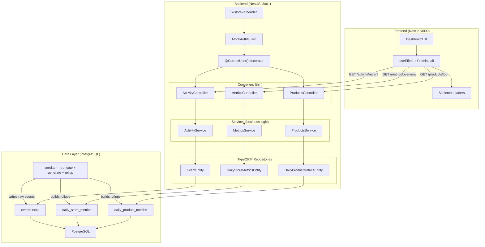

# Amboras Store Analytics Dashboard

Analytics dashboard for Amboras store owners. Shows revenue (today/week/month), conversion funnel, top 10 products by revenue, and a live activity feed.

> **What's real vs. simulated:**
> - **Real:** PostgreSQL database, TypeORM with schema auto-sync, roll-up logic, multi-tenancy scoping, Swagger docs
> - **Simulated:** Auth is mock headers (`x-store-id`, `x-user-id`) — no JWT, trivially spoofable. Do not deploy as-is.

---

## Stack

| Layer | Choice | Rejected |
|---|---|---|
| Backend | NestJS (TypeScript) | Express — NestJS gives DI, guards, and decorators out of the box, which matters for clean multi-tenancy |
| Frontend | Next.js (TypeScript) | CRA / Vite SPA — Next.js gives SSR as a future option without a rewrite |
| ORM | TypeORM (`synchronize: true`) | Prisma — TypeORM's repository pattern maps more naturally to the service-layer architecture used here |
| Database | PostgreSQL | SQLite — Postgres is the production target; no point optimising for a DB you'll replace |
| Runtime | Bun | npm/yarn — faster installs and script execution; no meaningful tradeoff at this scale |
| API | REST | GraphQL — unnecessary for a fixed set of dashboard queries with no nested or variable data shapes |

---

## Setup

**Prerequisites:** Bun v1.0+, Node.js v18+, PostgreSQL running locally
```bash
git clone git@github.com:aetosdios27/Amboras-Take-Home-Assignment-Solution.git
cd Amboras-Take-Home-Assignment-Solution
```

### 1. Start PostgreSQL

**Arch Linux:**
```bash
sudo systemctl enable postgresql
sudo systemctl start postgresql
```

**macOS (Homebrew):**
```bash
brew services start postgresql@15
```

### 2. Create the database
```bash
psql -U postgres
```
```sql
CREATE DATABASE store_analytics;
CREATE USER your_db_username WITH PASSWORD 'your_db_password';
GRANT ALL PRIVILEGES ON DATABASE store_analytics TO your_db_username;
\q
```

### 3. Backend
```bash
cd backend
bun install
cp .env.example .env
# Fill in DB_USERNAME and DB_PASSWORD with what you just created
```

Start the server first — TypeORM auto-syncs the schema on boot (`synchronize: true`). The seed needs the tables to exist before it can write.
```bash
bun run start:dev
# → http://localhost:3001
# → Swagger docs at http://localhost:3001/api/docs
# Wait until you see "Backend running on http://localhost:3001"
```

Then in a second terminal, seed the database:
```bash
bun run seed
```

This truncates all tables, generates 5 stores × 30 days of events (~40 products per store), writes raw events, and builds the daily roll-up aggregates in one shot. Safe to re-run — it resets everything first.

After seeding you'll see:
```
Use headers like: x-user-id=user_1, x-store-id=store_1
```

Use these headers on every API request.

### 4. Frontend
```bash
cd ../frontend
bun install
cp .env.example .env.local
# NEXT_PUBLIC_API_URL=http://localhost:3001
bun run dev
# → http://localhost:3000
```

If you see skeleton loaders on first paint and then data populates, everything is working.

---

## Architecture Decisions

The diagram below shows the full system. Each decision explains the reasoning behind a specific part of it.


---

### Decision 1: Pre-aggregated daily metrics over runtime event aggregation

**Chose:** `DailyStoreMetricsEntity` and `DailyProductMetricsEntity` — pre-rolled daily summaries queried and summed at request time per range (today / week / month).

**Rejected:** Querying `EventEntity` directly for aggregates — `SUM(revenue) WHERE date >= X GROUP BY product`.

**Why it matters to the store owner:** A store owner opens their dashboard first thing in the morning to decide what to promote and what's underperforming. If that page takes 6 seconds, they stop trusting it. The < 2s target isn't arbitrary — it's the threshold between a tool people use daily and one they abandon.

**Concrete tradeoff:** At 10,000 events/minute, a 30-day revenue query on raw events scans ~432M rows. The same query on pre-aggregated daily rows scans at most 30 rows per store — the difference between a ~4–6s query and a ~5ms query without heroic indexing.

**What we gave up:** Metrics reflect data as of the last completed roll-up. A purchase made after the last seed/roll-up won't appear until the next one runs. For a daily-summary dashboard this is acceptable. For a sub-minute view it isn't.

**Roll-up implementation:** The roll-up logic lives in `SeedService.buildRollups()` and runs as part of `bun run seed`. It iterates all generated events and builds `DailyStoreMetricsEntity` and `DailyProductMetricsEntity` records in memory before writing them in chunks. What's not implemented is a scheduled cron job — in production this would run nightly via a queue worker (BullMQ) or a cron expression in NestJS's `@nestjs/schedule`.

**At 100M+ events:** The daily roll-up job becomes the critical path. You'd shard aggregation by `storeId`, run it on a read replica, and likely replace the roll-up pattern entirely with Materialized Views or a columnar store (ClickHouse, BigQuery).

---

### Decision 2: Direct query for activity feed vs. batching

**Chose:** Query `EventEntity` directly — `ORDER BY timestamp DESC LIMIT N WHERE storeId = ?`

**Rejected:** Pre-aggregating or caching the activity feed the same way as metrics.

**Why:** The activity feed serves a different user need than the metrics. Metrics answer "how am I doing overall?" — the feed answers "what just happened right now?" A store owner who sees a revenue spike wants to immediately scan the feed to understand why. Batching the feed introduces the same lag as the metrics, which breaks that use case entirely.

**Concrete tradeoff:** Direct queries are fast now (milliseconds at seed-data scale) and become a liability later. At ~10M events per store, an unindexed `timestamp DESC` scan slows down noticeably. At ~100M events, it breaks without partitioning.

**Edge case handled:** Feed is scoped strictly to `storeId` on every query — no cross-tenant event leakage.

**Edge case not handled:** No cursor-based pagination. The feed returns the latest N events and stops. A high-volume store at 10 events/second will make this feel stale quickly — the real fix is WebSocket or SSE push.

**At 100M+ events:** Partition the events table by `(storeId, date)`. For true real-time, move the feed to a dedicated event stream (Kafka topic per store) consumed via SSE or WebSocket. Direct DB queries for a live feed don't survive at scale.

---

### Decision 3: Client-side fetching over SSR

**Chose:** Client-side data fetching — `useEffect` + `Promise.all` for concurrent requests, `useState` for loading/error states, skeleton loaders on first paint.

**Rejected:** Next.js SSR (`getServerSideProps`) or React Server Components for data fetching.

**Why:** SSR makes sense when a page is public or cacheable — Google can index it, the HTML can be served from cache to many users. This dashboard is private, authenticated, and unique per store owner. SSR would block the initial HTML response while waiting on API calls server-side, making the user stare at a blank tab instead of a skeleton — same total wait time, worse perceived experience, with none of the SSR benefits.

**Pattern used:** TypeORM repository pattern with a service layer. Controllers are thin — they validate input and call services. Services own all business logic and repository interactions. This keeps the HTTP layer clean and makes the business logic independently testable without spinning up the full HTTP stack.

**Tradeoff:** As the dashboard grows (date range pickers, cross-widget filters), `useState` per component won't scale. A shared state manager (Zustand, Jotai) should replace it before the component tree gets deep. The current structure makes that migration straightforward — state is already co-located per widget.

---

### Decision 4: `storeId` scoping for multi-tenancy

**Chose:** Filter every query by `storeId` at the application layer, extracted from `MockAuthGuard` via the `@CurrentUser()` decorator.

**Rejected:** Row-level security at the database layer (Postgres RLS).

**Why:** Application-layer scoping is explicit, auditable, and testable. Every repository call receives `storeId` as a parameter — there is no code path where a query runs without it. RLS would push the isolation guarantee into database config, which is harder to audit and one misconfiguration away from a cross-tenant leak.

**The fake part:** `MockAuthGuard` reads `storeId` from the `x-store-id` request header. Any client can set this to any value and read any store's data. This is intentional for local dev — it makes switching between test stores trivial. In production, `storeId` must come from a verified JWT claim. The JWT packages (`@nestjs/jwt`, `passport-jwt`) are already installed — `MockAuthGuard` just needs replacing.

**Edge case handled:** Missing `x-store-id` header returns 401, not an empty dataset. Silently returning empty data on a missing tenant header is worse than an explicit error — you can't tell the difference between "no data" and "wrong tenant."

**Edge case not handled:** No rate limiting per `storeId`. A single tenant could hammer the API and degrade performance for all others.

---

## Performance

**Implemented:**
- Aggregate queries hit pre-aggregated tables — not raw events
- Backend uses `Promise.all` where independent queries can run in parallel
- Frontend fires all three API calls concurrently on mount — no waterfall
- Helmet + compression middleware on all responses
- `ResponseTimeInterceptor` logs response times per endpoint
- Skeleton loaders on all data-heavy components — no blank screen

**Not implemented — would matter before production:**

| Gap | Impact | Fix |
|---|---|---|
| No Redis caching | Aggregate queries hit Postgres on every page load | Cache with TTL aligned to roll-up frequency — these values change at most once per cycle |
| No DB indexes validated | Assumed indexes on `storeId`, `date`, `productId` — not confirmed | Add and verify composite indexes before any load testing |
| No connection pooling config | Default TypeORM pool may be undersized under concurrent load | Configure `pg` pool size based on expected concurrency |
| No table partitioning | Events table becomes a bottleneck past ~50M rows | Partition by `(storeId, date)` |

> Redis (`ioredis`, `@nestjs/cache-manager`) is already installed as a dependency — caching layer needs implementation, not new packages.

---

## Known Limitations

| Area | Reality |
|---|---|
| Auth | Mock headers. Any value accepted. Do not deploy. JWT packages installed, guard needs replacing. |
| Roll-up scheduling | No cron job. Roll-ups are built once by `bun run seed`. Metrics go stale until re-seeded. |
| Activity feed | No pagination, no cursor, no WebSocket. Returns latest N events and stops. |
| Real-time | No push. Metrics are stale until page refresh. |
| Error states | API failures render as empty widgets — users won't know why data is missing. |
| Tests | None. Aggregation logic and service layer are the highest-priority targets. |
| Observability | No structured logging, no metrics endpoint, no alerting. |
| Input validation | Class-validator is configured but coverage is minimal. Not hardened against adversarial input. |

---

## Production Checklist

- [ ] Replace `MockAuthGuard` with JWT — `storeId` from verified token claim, not header
- [ ] Implement nightly roll-up worker (BullMQ or `@nestjs/schedule` cron)
- [ ] Redis caching on `/metrics/overview` and `/products/top` with TTL aligned to roll-up
- [ ] Composite indexes on `(storeId, date)`, `(storeId, productId)`
- [ ] WebSocket or SSE for activity feed
- [ ] Cursor-based pagination on activity feed
- [ ] Structured logging (Pino) + metrics (Prometheus) + dashboards (Grafana)
- [ ] Rate limiting per `storeId`
- [ ] Custom date range support across all analytics views
- [ ] Test coverage: aggregation logic (unit), API endpoints (integration), auth scoping (security)
- [ ] Replace `synchronize: true` with proper TypeORM migrations before any production deployment

---
