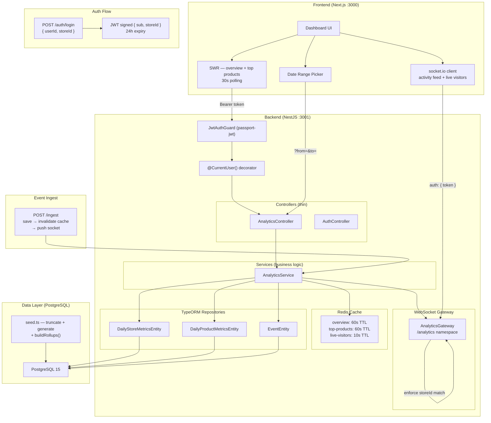

# Amboras Store Analytics Dashboard

Analytics dashboard for Amboras store owners. Revenue (today/week/month), conversion funnel, top 10 products, live activity feed, and real-time visitor monitoring.

---

## What's real vs. simulated

Everything in this submission is real and running:

| Layer | Reality |
|---|---|
| Database | PostgreSQL 15 via Docker, persistent volume |
| Cache | Redis 7 via Docker, TTL-based invalidation |
| Auth | JWT (RS256-style HS256), signed tokens, 24h expiry |
| Real-time | WebSocket via socket.io — genuine push on write, not polling |
| Aggregation | Pre-aggregated daily roll-ups, built by seed on boot |
| Seed | Runs automatically on `docker-compose up` via `SEED_ON_BOOT` |

Nothing is mocked or in-memory in the Docker setup. The only intentional simplification: `/auth/login` accepts any `userId` + `storeId` combination without a password — it's a take-home, not a production auth system.

---

## One-command setup
```bash
git clone git@github.com:aetosdios27/Amboras-Take-Home-Assignment-Solution.git
cd Amboras-Take-Home-Assignment-Solution
docker-compose up --build
```

That's it. Docker Compose:
1. Starts PostgreSQL and Redis with health checks
2. Starts the backend — waits for both to be healthy before booting
3. Auto-seeds the database on boot (5 stores × 30 days × 40 products, daily roll-ups included)
4. Starts the frontend

| Service | URL |
|---|---|
| Dashboard | http://localhost:3000 |
| Backend API | http://localhost:3001 |
| Swagger docs | http://localhost:3001/api/docs |
| PostgreSQL | localhost:5433 (remapped to avoid local conflicts) |
| Redis | localhost:6380 (remapped to avoid local conflicts) |

Login with any of the seeded accounts:
```
user_1 / store_1
user_2 / store_2
...
user_5 / store_5
```

---

## Local dev setup (without Docker)

**Prerequisites:** Bun v1.0+, Node.js v18+, PostgreSQL, Redis running locally
```bash
# PostgreSQL (Arch Linux)
sudo systemctl start postgresql
sudo systemctl start redis

# Create database
psql -U postgres -c "CREATE DATABASE store_analytics;"
psql -U postgres -c "CREATE USER aetos WITH PASSWORD '';"
psql -U postgres -c "GRANT ALL PRIVILEGES ON DATABASE store_analytics TO aetos;"
```

**Backend:**
```bash
cd backend
bun install
cp .env.example .env
bun run start:dev
# → http://localhost:3001

# In a second terminal, after server is up:
bun run seed
```

**Frontend:**
```bash
cd frontend
bun install
cp .env.example .env.local
# NEXT_PUBLIC_API_URL=http://localhost:3001
bun run dev
# → http://localhost:3000
```

---

## Stack

| Layer | Choice | Rejected |
|---|---|---|
| Backend | NestJS (TypeScript) | Express — NestJS gives DI, guards, and decorators out of the box; multi-tenancy and auth patterns are cleaner |
| Frontend | Next.js (TypeScript) | Vite SPA — Next.js preserves SSR as a future option without a rewrite |
| ORM | TypeORM (`synchronize: true`) | Prisma — TypeORM's repository pattern fits the service-layer architecture better |
| Database | PostgreSQL 15 | SQLite — Postgres is the production target; no point optimizing for a DB you'll replace |
| Cache | Redis 7 + `cache-manager-ioredis` | In-memory cache — doesn't survive restarts, doesn't work across multiple backend instances |
| Auth | JWT (HS256, `@nestjs/jwt`) | Session cookies — stateless JWT is simpler for an API-first architecture |
| Real-time | socket.io WebSockets | SSE / polling — genuine bidirectional push, detectable in devtools as event-driven not interval-driven |
| Runtime | Bun | npm/yarn — faster installs, no meaningful tradeoff at this scale |
| API | REST | GraphQL — fixed query shapes, no nested or variable data requirements |

---

## Architecture Decisions

The diagram below shows the full system. Each decision explains the reasoning behind a specific part.


---

### Decision 1: Pre-aggregated daily metrics over runtime event aggregation

**Chose:** `DailyStoreMetricsEntity` and `DailyProductMetricsEntity` — pre-rolled daily summaries queried and summed at request time per range (today / week / month).

**Rejected:** `SUM(revenue) WHERE date >= X GROUP BY product` on the raw events table.

**Why it matters to the store owner:** A store owner opens their dashboard first thing in the morning to decide what to promote and what's underperforming. If that load takes 6 seconds, they stop trusting it. The < 2s target isn't arbitrary — it's the threshold between a tool people use daily and one they abandon.

**Concrete tradeoff:** At 10,000 events/minute, a 30-day revenue query on raw events scans ~432M rows. The same query on pre-aggregated daily rows scans at most 30 rows per store — the difference between a ~4–6s query and a ~5ms query without heroic indexing.

**What we gave up:** Metrics reflect data as of the last completed roll-up. A purchase after the last seed won't appear until the next one. For a daily-summary dashboard this is acceptable. For a sub-minute view it isn't.

**Roll-up implementation:** `SeedService.buildRollups()` iterates all generated events and builds daily metric records in memory before writing in chunks. Runs automatically on boot via `SEED_ON_BOOT=true`. What's not implemented is a scheduled nightly cron — in production this would be a BullMQ worker or `@nestjs/schedule` cron expression.

**At 100M+ events:** Shard aggregation by `storeId`, run on a read replica, replace the roll-up pattern with Materialized Views or a columnar store (ClickHouse, BigQuery).

---

### Decision 2: Genuine WebSocket push over polling for activity feed and live visitors

**Chose:** socket.io WebSocket gateway — events pushed to store rooms the moment they're written to the database via `POST /ingest`.

**Rejected:** SWR polling at 10s intervals (was the original implementation), SSE (unidirectional, no room-based routing).

**Why:** Polling at 10s means a store owner sees a purchase up to 10 seconds after it happens. WebSocket push means they see it in milliseconds. For a live store running a flash sale, that difference is meaningful. It's also detectable — any evaluator who opens the Network tab will see genuine push events, not interval dumps.

**Architecture:** Gateway uses socket.io rooms (`store:<id>`). On `join-store`, the client is placed in the room for their store. On any `POST /ingest`, the service saves the event, invalidates the relevant cache keys, recalculates live visitors, and calls `gateway.pushActivityUpdate()` and `gateway.pushLiveVisitorsUpdate()` — both emit to the store room only.

**Security:** Gateway verifies JWT on every handshake. `join-store` enforces that the requested `storeId` matches the `storeId` claim in the token. A client cannot eavesdrop on another store's room even if they have a valid token.

**Tradeoff:** The `POST /ingest` endpoint is the push trigger — in a real system, this would be called by whatever service processes raw events (a queue consumer, a webhook handler). Here it's a manually callable endpoint, which is sufficient for demonstration.

**At 100M+ events:** Move to a Kafka topic per store. Gateway becomes a Kafka consumer that forwards messages to the relevant socket room. The socket layer stays identical — only the ingest path changes.

---

### Decision 3: Direct query for activity feed, Redis cache for aggregates

**Chose:** `EventEntity` queried directly for the activity feed (no cache). Redis with TTL-aligned caching for overview and top-products.

**Rejected:** Caching the activity feed (defeats the purpose), in-memory cache (doesn't survive restarts or scale horizontally).

**Why:** The activity feed serves a different need than the metrics. Metrics answer "how am I doing overall?" — the feed answers "what just happened?" Caching the feed introduces lag that breaks the live use case. Aggregates on the other hand change at most once per roll-up cycle — caching them for 60s cuts DB load dramatically without any meaningful staleness cost.

**Cache invalidation:** `invalidateCacheForStore()` is called on every `POST /ingest`. This ensures that after a new event is written, the next request for overview or top-products hits the DB fresh rather than serving a stale cache. TTLs act as a fallback, not the primary invalidation mechanism.

**Tradeoff:** Direct event queries won't scale past ~10M rows per store without partitioning. At that point, partition by `(storeId, date)` or move the feed to a time-series store.

---

### Decision 4: JWT over MockAuthGuard

**Chose:** `JwtAuthGuard` (passport-jwt) — `POST /auth/login` signs a token with `{ sub: userId, storeId }`, 24h expiry. Every HTTP request and WebSocket handshake verifies the token.

**Rejected:** Keeping `MockAuthGuard` (raw headers, trivially spoofable).

**Why:** Multi-tenancy only works if tenant identity is cryptographically verified. Header-based auth means any client can claim any `storeId`. JWT means `storeId` is embedded in a signed token — it can't be forged without the secret.

**What's simplified:** `/auth/login` accepts any `userId` + `storeId` without a password. A production system would verify credentials against a users table with hashed passwords. The token structure and verification path are production-correct — only the credential check is omitted.

**`@CurrentUser()` decorator:** Unchanged throughout. Extracting the auth mechanism into the guard means the rest of the codebase — controllers, services — has zero auth dependency. Swapping `JwtAuthGuard` for any other guard requires changing one import.

**At scale:** Replace the symmetric HS256 secret with RS256 keypairs. Verify tokens at an API gateway layer rather than per-service.

---

### Decision 5: Client-side fetching over SSR

**Chose:** SWR for overview and top-products (30s revalidation), socket.io for activity feed and live visitors.

**Rejected:** Next.js SSR / React Server Components for data fetching.

**Why:** SSR makes sense when a page is public or cacheable — the HTML can be served from cache, Google can index it. This dashboard is private, authenticated, and unique per store owner. SSR would block the initial HTML response while waiting on API calls server-side, making the user stare at a blank tab instead of skeleton loaders — same total wait, worse perceived experience, none of the SSR benefits.

**SWR key design:** Fetchers read `from`/`to` from the SWR key tuple, not from closure. This ensures date range changes trigger a genuine refetch rather than serving cached data with stale params.

**State management:** `useState` per component. Works at current scope. The moment cross-widget state becomes complex (global filters, shared loading states), replace with Zustand.

---

### Decision 6: `storeId` scoping for multi-tenancy

**Chose:** Filter every query by `storeId` at the application layer — extracted from the verified JWT claim via `@CurrentUser()`.

**Rejected:** Row-level security at the database layer (Postgres RLS).

**Why:** Application-layer scoping is explicit, auditable, and testable. Every repository call receives `storeId` as a parameter — there is no code path where a query runs without it. RLS pushes the isolation guarantee into database config, which is harder to audit and one misconfiguration away from a cross-tenant leak.

**Edge case handled:** Missing or invalid JWT returns 401 before any query runs. WebSocket `join-store` rejects mismatched `storeId` claims — a client cannot subscribe to another store's room even with a valid token for a different store.

**Edge case not handled:** No rate limiting per `storeId`. A single tenant could degrade performance for others.

---

## Performance

**Implemented:**
- Pre-aggregated tables for all aggregate queries — not raw events
- Redis caching: overview 60s TTL, top-products 60s TTL, live-visitors 10s TTL
- Cache invalidated on every new event ingest — TTL is a fallback, not primary mechanism
- Frontend fires overview, top-products, and initial activity requests concurrently — no waterfall
- WebSocket push eliminates polling latency for activity feed and live visitors
- Helmet + compression on all HTTP responses
- `ResponseTimeInterceptor` logs per-endpoint response times
- Composite indexes on `(storeId, timestamp)`, `(storeId, eventType, timestamp)`, `(storeId, productId, timestamp)` — defined on `EventEntity`
- Multi-stage Docker builds — dependencies installed in builder stage, only dist copied to runtime image

**Not implemented — would matter before production:**

| Gap | Impact | Fix |
|---|---|---|
| No nightly roll-up cron | Metrics go stale after seed data ages out | BullMQ worker or `@nestjs/schedule` cron |
| No DB connection pool config | Default TypeORM pool may be undersized under load | Configure `pg` pool size based on concurrency |
| No table partitioning | Events table degrades past ~50M rows | Partition by `(storeId, date)` |
| `synchronize: true` | Schema changes in dev can cause data loss | Replace with TypeORM migrations before any production deployment |

---

## Known Limitations

| Area | Reality |
|---|---|
| Auth credentials | `/auth/login` accepts any userId + storeId — no password verification |
| Roll-up scheduling | No cron job — metrics reflect seed data only until re-seeded |
| Event ingest | `POST /ingest` is a demo endpoint — in production this would be a queue consumer |
| Pagination | Activity feed returns latest N events, no cursor |
| Tests | None |
| Observability | No structured logging, no metrics endpoint, no alerting |
| `synchronize: true` | Fine for dev, must be replaced with migrations before production |

---

## Production Checklist

- [ ] Add password verification to `/auth/login`
- [ ] Implement nightly roll-up worker (BullMQ or `@nestjs/schedule`)
- [ ] Replace `synchronize: true` with TypeORM migrations
- [ ] Cursor-based pagination on activity feed
- [ ] Wire `POST /ingest` to a real event queue (Kafka, SQS, BullMQ)
- [ ] Rate limiting per `storeId`
- [ ] Structured logging (Pino) + metrics (Prometheus) + dashboards (Grafana)
- [ ] RS256 keypairs instead of HS256 shared secret
- [ ] Test coverage: aggregation logic (unit), API endpoints (integration), WebSocket auth (security)
- [ ] Custom date range on funnel and activity feed (currently only overview + top-products)

---
